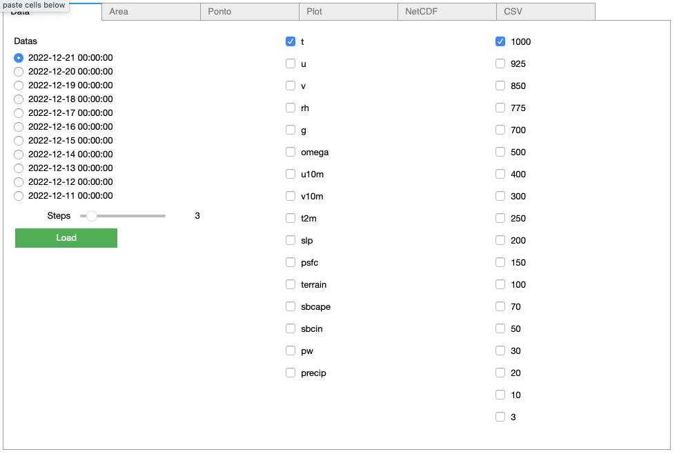
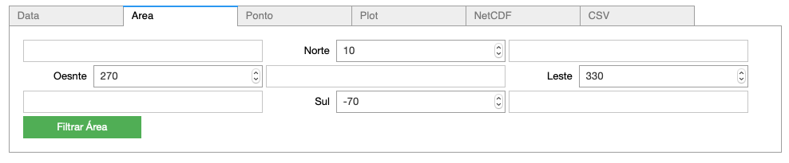
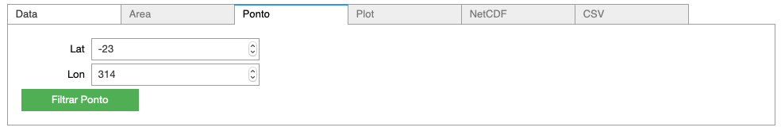
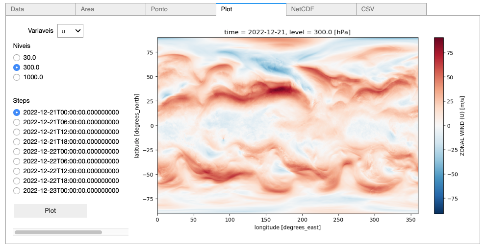
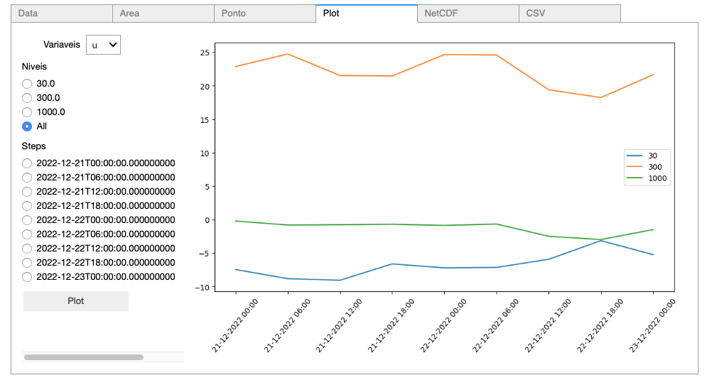

Exemplos
========

Exemplo 1
---------

    Executing the following code:
    
    ::
            
        log(substring("Welcome to our site!", 0, 7));
        log(substring("Welcome to our site!", 0));
        
    will print:
    
    ::
    
        Welcome
        Welcome to our site!

   

|pic1| - |pic2| - |pic3| - |pic4|

See :download:`this example script <SCRIPTS/Example_lib_Widgets.ipynb>`.

Exemplo 2
---------

    Executing the following code:
    
    ::
            
        log(substring("Welcome to our site!", 0, 7));
        log(substring("Welcome to our site!", 0));
        
    will print:
    
    ::
    
        Welcome
        Welcome to our site!

   

|pic1| - |pic2| - |pic3| - |pic4|

See :download:`this example script <SCRIPTS/Example_lib_Widgets.ipynb>`.
